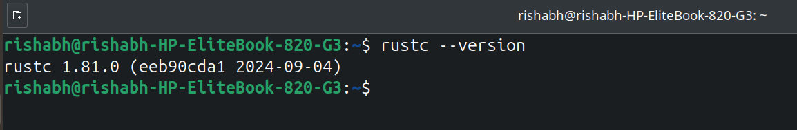
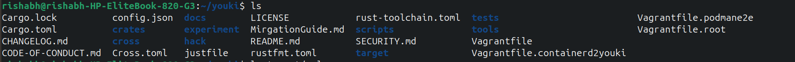
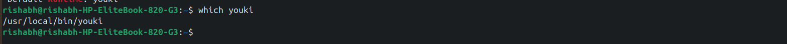
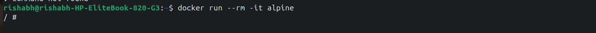
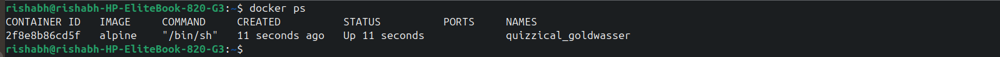
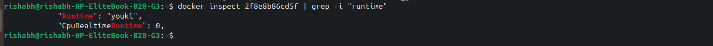
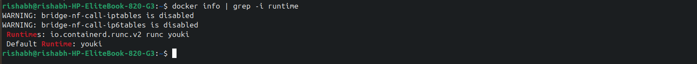
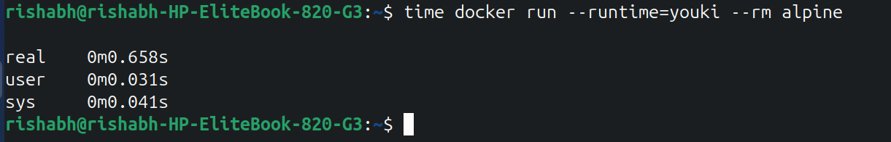
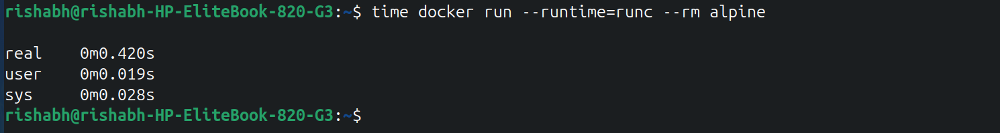

# Objective
**To build and Deploy Youki Container Runtime in Linux.**

# Table of Contents
- [Introduction](#introduction)
- [Step 1: Install Rust](#step-1-install-rust)
- [Step 2: Build Youki](#step-2-build-youki)
- [Step 3: Setting up Youki as a Default Runtime](#step-3-setting-up-youki-as-a-default-runtime)
- [Step 4: Run a Container Using Youki Runtime](#step-4-run-a-container-using-youki-runtime)
- [Step 5: Ensuring that the Image Pulled is Using Youki Runtime](#step-5-ensuring-that-the-image-pulled-is-using-youki-runtime)
- [Step 6: Checking default runtime](#step-6-checking-default-runtime)
- [Conclusion](#conclusion)


## Introduction
This journal documents the steps taken to set up Youki, a tool that helps run applications in containers. Containers are like small packages that include everything needed to run a program. We will also need Docker, which helps manage these containers.

---
## Why we use Youki Runtime-:
1. **Lightweight:** Youki is small and doesn’t need much memory, making it fast and efficient.
2. **Faster Performance:** Since Youki uses fewer resources, it runs containers faster compared to other runtimes.
3. **Compatibility:** Youki works with Docker and Kubernetes, so you can use it with common container tools.
4. **Simple to Set Up:** It’s easy to install and get running, saving time on setup.
---

### Machine Info-
- Machine Model: "HP EliteBook 820 G3"
- Operating System:"Ubuntu 24.04.1 LTS"
- Processor:"Intel Core i5"
- We have Docker installed in our system.

---

### Step 1: Install Rust

1. **Install Rust:**
   - Type this command and press Enter:

      ```bash
     curl --proto '=https' --tlsv1.2 -sSf https://sh.rustup.rs | sh
     ```

      - curl: Tool to transfer data from or to a server.
     - --proto '=https': Only use HTTPS protocol.
     - --tlsv1.2: Use TLS version 1.2 for security.
     - -sSf: Options for silent mode, show errors, and fail on server errors.
     - https://sh.rustup.rs: URL to the Rust installation script.
     - | sh: Pipes the script to the shell for execution.

**Why -** We are installing Rust language because, Rust provides the tools needed to compile (build) Youki from its source code and make it work properly. 
     
**Follow the instructions on the screen.**

2. **Install Cargo (package manager for rust):**

   ```bash
   sudo apt install cargo
   ```

**Why -** We installed Cargo while working on the Youki task because Cargo is the package manager and build system for the Rust programming language, which is essential for developing, compiling, and managing Rust projects.
   
3. **Configure your current shell**

- Type this command.
        
  ```bash
     source $HOME/.cargo/env
  ```
 
     - source: Loads the settings from a file into the current shell session.
     - $HOME/.cargo/env: Path to the environment setup file for Rust, located in the .cargo folder in your home directory.

**Why -**  After setting up the shell (your command line), you can use Rust commands directly in the terminal without needing to go to the folder where Rust is installed. This makes it easier to run Rust from anywhere on your computer.
   
**Now, Check if Rust is installed by typing:**
     
   ```bash
     rustc --version
   ```
- --version: This option tells it to display the version number.

**Why -** To ensure rust is installed in your system.

   **You should see the version number of Rust compiler as shown in image.**
    

---
## Step 2: Build Youki

### Task:
- Now, we will build Youki from its source code.

### Steps to Build Youki:

1. **Install Required Dependencies:**
   - Type this command:
     ```bash
     sudo apt-get install libseccomp-dev pkg-config build-essential
     ```

- sudo: Runs the command with superuser (administrator) privileges.
- apt-get: A command-line tool for handling packages in Debian-based systems.
- install: Installs the specified packages.
- libseccomp-dev: This is a library that helps in applying security rules to control what actions programs can take. 
- pkg-config: This tool helps your system find other libraries that Youki needs to work properly..
- build-essential: This package provides basic development tools like compilers, which are needed to build (compile) Youki from its source code.

**Why -** Dependencies are like helpers that make sure Youki has everything it needs to function well. Without them, Youki might not work correctly or could have problems.

2. **Clone the Youki Repository:**
   -  Run this command :
     ```bash
     git clone https://github.com/containers/youki.git
     ```
**Why -** Cloning the repository means we are downloading Youki's code from the internet to our computer so we can use it and make changes if we want.

3. **Change Directory to Youki Folder:**
   - Run this command to move to the Youki folder:
     ```bash
     cd youki
     ```
**Why -** We have to compile and see we have all the compilation files in the folder.

4. **Build Youki:**
   - Type this command to compile the code:
     ```bash
     cargo build --release
     ```

     - cargo: The Rust package manager and build system.
     - build: The command to compile the project.
     - --release: Flag to optimize the build for release (faster and smaller executable).
       
**Why -** We use this command to create the Youki program in a way that makes it run faster and use less memory.

 **After this, you can list the contents of this youki directory by running ls command on terminal**
   
   
---

## Step 3: Setting up Youki as a default runtime
### Task:
- Configure Docker to use Youki by default.

### Steps to Set Youki as Default:

1. **Edit Docker's Configuration File:**
   - Run this command to open the file for editing:
     ```bash
     sudo vim /etc/docker/daemon.json
     ```
   - sudo: Runs the command with superuser (administrator) privileges.
   - vim: A text editor used to edit files in the terminal.
   - /etc/docker/daemon.json: The path to the Docker daemon configuration file, where you can set various options for the Docker service.

**Why -** By changing this file, we're telling Docker to use Youki as its main tool for running containers. This makes it easier for us to use Youki without having to choose it every time.

 **Daemon** is a background program that runs on your computer and helps manage tasks without direct user interaction.
 
 **Json** (JavaScript Object Notation file) is a text file that stores data in a structured way using key-value pairs.
 
   - For editing through vim text editor firstly press "i" for inserting text and then when you insert the complete mentioned text in daemon.json file press esc key to exit from inserting mode and then press :wq for saving the edited file.
     

**for checking where youki was build type command**
```bash
   which youki
```
 

2. **Add Youki as the Default Runtime:**
   - Add this code inside the file:
  ```json
      {
        "default-runtime": "youki",
           "runtimes": {
               "youki": {
         "path": "/usr/local/bin/youki"
        }
      }
}
 ```


3. **Restart Docker:**
   - Type this command:
     ```bash
     sudo systemctl restart docker
     ```
**When we restart Docker, it refreshes everything and learns to use Youki to manage containers.**
---

## Step 4: Run a container using Youki Runtime

### Task:
- Run a container using Youki.

### Steps to Pull and Run a Container:

1. **Pull an Image from Docker Hub:**
   - This downloads a image of a program. Type:

      ```bash
         docker pull alpine
      ```
     **After running this command an Image will be pulled.**
**Why -** We pull an image from a repository (like Docker Hub) to our computer. This image contains all the necessary files and settings needed to run an application inside a container.

2. **Run a Container Using Youki**
   - Start a container using the command:

      ```bash
     docker run --rm -it alpine
     ```
      
     - docker: Command-line tool for managing Docker containers.
     - run: Tells Docker to create and start a new container.
     - --rm: Automatically removes the container when it exits.
     - -it: Combines two options:
     - -i: Keeps the standard input open.
     - -t: Allocates a pseudo-TTY (terminal).
     - alpine: The name of the Docker image to use, which is a lightweight Linux distribution.



**We can see in above image that container is running for verifying it we can Run following command**
 
  ```bash
     docker ps
  ```
   - docker: This is the command-line interface for interacting with Docker.
   - ps: This stands for "process status." In the context of Docker, it lists the containers that are currently active (running).
  


**Why -** For verifying running container .

---

## Step 5: Ensuring that the images which is pulled is using runtime Youki.

```bash
docker inspect CONTAINER_ID | grep -i "runtime"

```


**Why -** We use the command to check what container runtime is being used for a specific container.

**For checking container id we can use**
```bash
docker ps
```


## Step 6: Checking default runtime.

```bash
docker info | grep -i runtime
```
- docker info: Shows details about Docker.
- |: Sends the output to the next command.
- grep -i runtime: Looks for lines that mention "runtime" (case insensitive).



**Why -** We have to verify which is our default runtime.

---
**Lets now verify which runtime is faster in starting container**

- Run this command on terminal to check start time of **youki** runtime.
```bash
time docker run --runtime=youki --rm alpine
```
- Here is the output in which we can check real time usage for running container using Youki runtime.



- Run this command on terminal to check start time of **runc** runtime.
```bash
time docker run --runtime=runc --rm alpine
```
- Here is the output in which we can check real time usage for running container using Runc runtime.



## How does this works -:

**After the command finishes, time outputs the time data in three parts:**
- **real:** The total time from when the command started until it finished (wall-clock time).
- **user:** The total CPU time spent in user mode by the process (i.e., performing tasks like executing the container code).
- **sys:** The total CPU time spent in system/kernel mode (i.e., performing system-related tasks like managing system calls or accessing hardware).

- The user and sys times are also useful to understand how much CPU time is spent in the user space and the kernel space, but real time is the most important indicator of runtime performance.So,we can conclude from here that **Youki** starts container faster than **Runc.**

## Conclusion
In this journal, I successfully installed Youki and configured it as the default runtime for Docker. This process involved several key steps, including installing Rust, building Youki from source, and setting up Docker to recognize Youki as its primary runtime.


