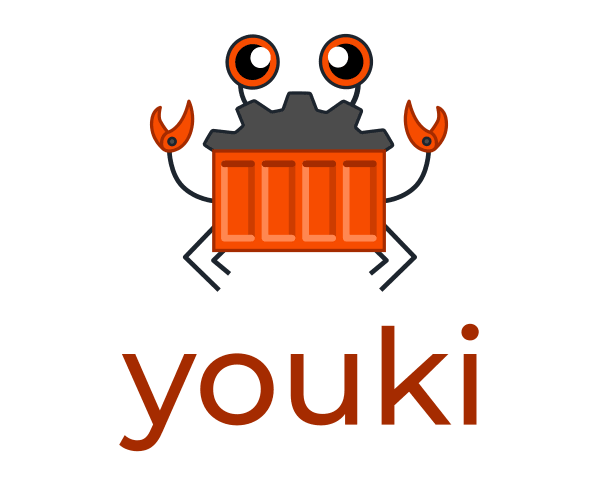

# Youki - Container Runtime 

## Overview
In this project, I installed and used the **Youki** container runtime on **Docker**. The main goal was to explore Youki as an alternative to Runc, and learn about container runtimes.

## Key Features
- **Youki Installation**: Installed Youki as the container runtime on the system.
- **Container Creation & Management**: Learned how to pull, create, and manage containers with Youki.
- **Performance Testing**: Compared CPU usage and performance between Youki and Docker.

## Key Learnings
- **Youki Runtime**: Youki is a lightweight and efficient container runtime that can be a good choice as it is bit faster then Runc.
- **Performance Comparison**: Youki used less CPU power and ran faster than runc for certain tasks.
- **Container Management**: Learned how to create, run, and manage containers from start to finish.

## Challenges Faced
- **Configuration Error**: While setting up Docker with Youki, I accidentally changed some config files, which caused Docker fail to start.

## Results
- Youki was successfully installed and configured.
- Managed containers with Youki and compared its performance to Runc.

## Future Work
- **Better Error Handling**: Future improvements can include handling more complex container configurations and issues.
- **Testing More Apps**: I plan to use this runtime with podman.

## Conclusion
The project was a success. I set up the Youki container runtime and tested its speed with respect to Runc. Youki is a lightweight and efficient container runtime which follows OCI standards(Open Container Initative).

