# Objective
**To build and Deploy Youki Container Runtime in Linux.**

# Table of Contents
- [Introduction](#introduction)
- [Step 1: Install Rust](#step-1-install-rust)
- [Step 2: Install Docker](#step-2-install-docker)
- [Step 3: Build Youki](#step-3-build-youki)
- [Step 4: Setting up Youki as a default runtime](#step-4-setting-up-youki-as-a-default-runtime)
- [Step 5: Run a container using Youki Runtime](#step-5-run-a-container-using-youki-runtime)
- [Step 6: Ensuring that the images which is pulled is using runtime Youki.](#step-6-ensuring-that-the-images-which-is-pulled-is-using-runtime-youki)
- [Conclusion](#conclusion)


## Introduction
This journal documents the steps taken to set up Youki, a tool that helps run applications in containers. Containers are like small packages that include everything needed to run a program. We will also install Docker, which helps manage these containers.

---

### Task:
- Learn about Youki and all the needed software and tools which are used in the task.
- Install Rust (the programming language Youki is built with).
- Install Docker (a tool to manage containers).
- Using Youki.
- Setting up Youki as default runtime.

---
### Machine Info-
- Machine Model: "HP EliteBook 820 G3"
- Operating System:"Ubuntu 24.04.1 LTS"
- Processor:"Intel Core i5"

--- 

### Step 1: Install Rust

1. **Open the Terminal:**
   - This is where we type commands for the computer to follow.
   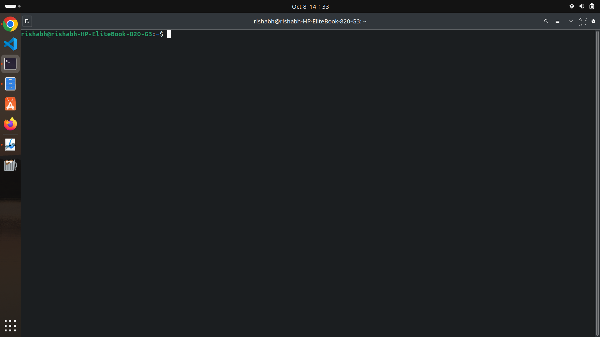

2. **Install Rust:**
   - Type this command and press Enter:
     ```bash
     curl --proto '=https' --tlsv1.2 -sSf https://sh.rustup.rs | sh
     ```
     - curl: Tool to transfer data from or to a server.
     - --proto '=https': Only use HTTPS protocol.
     - --tlsv1.2: Use TLS version 1.2 for security.
     - -sSf: Options for silent mode, show errors, and fail on server errors.
     - https://sh.rustup.rs: URL to the Rust installation script.
     - | sh: Pipes the script to the shell for execution.
   
    **Follow the instructions on the screen.**

3. **Install Cargo (package manger for rust):**

   ```bash
   sudo apt install cargo
   ```
   
5. **Configure your current shell**

   - Type this command, After configuring the shell, you can run Rust commands directly from the terminal without navigating to the installation 
      directory.
     
     ```bash
     source $HOME/.cargo/env
     ```
     - source: Loads the settings from a file into the current shell session.
     - $HOME/.cargo/env: Path to the environment setup file for Rust, located in the .cargo folder in your home directory.
    
    **Now, Check if Rust is installed by typing:**
     ```bash
     rustc --version
     ```
     - --version: This option tells it to display the version number.
     
     **You should see the version number of Rust compiler as shown in image.**
    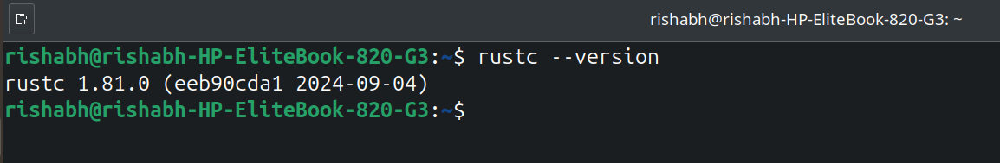

---
## Step 2: Install Docker

### What is Docker?
- Docker is a tool that helps developers create, run, and manage containers. Containers are lightweight, portable units that package an application and everything it needs to run—like libraries, dependencies, and configurations.

### Installation Steps for Docker on Ubuntu:

1. **Update the Package List:**
    - **The command updates the local database of available packages. It fetches the latest information about available software from the repositories defined in your system.**
   - Open the Terminal and type:
     ```bash
     sudo apt-get update
     ```
   - sudo: Runs the command with administrator privileges.
   - apt-get update: Updates the package index for your system.

    **This command checks for updates in the system's package list.**

1. **Install Necessary Packages:**
   - Type this command:
     ```bash
     sudo apt-get install apt-transport-https ca-certificates curl software-properties-common
     ```
   - sudo: Runs the command with superuser (administrator) privileges.
   - apt-get: A command-line tool for handling packages in Debian-based systems.
   - install: Installs the specified packages.
   - apt-transport-https: Allows APT to use HTTPS for secure package downloads.
   - ca-certificates: Installs certificates to verify the authenticity of SSL connections.
   - curl: Installs the tool for transferring data from or to a server (already mentioned earlier).
   - software-properties-common: Provides tools to manage software repositories easily.
   
    **This installs tools needed for Docker to work correctly.**

2. **Add Docker’s Official GPG Key:**
   - Type the following command:
     ```bash
     curl -fsSL https://download.docker.com/linux/ubuntu/gpg | sudo apt-key add -
     ```
    - curl: Tool to transfer data from or to a server.
    - -fsSL: Options for fail silently, show errors, and follow redirects.
    - https://download.docker.com/linux/ubuntu/gpg: URL where the Docker GPG key is located.
    - |: Pipes the output of the previous command into the next command.
    - sudo: Runs the command with superuser (administrator) privileges.
   - apt-key add -: Adds the GPG key to APT's trusted keys, allowing your system to verify the authenticity of Docker packages.
   
    **This step ensures that your system trusts Docker's software.**
   
3. **Add Docker’s APT Repository:**
   -Type this command
     ```bash
     sudo add-apt-repository "deb [arch=amd64] https://download.docker.com/linux/ubuntu $(lsb_release -cs) stable"
     ```
- sudo: Runs the command with superuser (administrator) privileges.
- add-apt-repository: A command to add a new software repository to APT.
- "deb [arch=amd64] https://download.docker.com/linux/ubuntu $(lsb_release -cs) stable":
- deb: Indicates that this is a Debian package repository.
- [arch=amd64]: Specifies that the packages are for 64-bit systems.
- https://download.docker.com/linux/ubuntu: The URL for the Docker repository.
- $(lsb_release -cs): This command gets the code name of your Ubuntu version (like focal for 20.04).

 **Adding Docker’s APT repository allows your system to find and install the latest version of Docker directly from its official source, ensuring you get the best features and security update.**

3. **Update the Package Index Again:**
   ```bash
   sudo apt update
   ```

4. **Install Docker**
   ```bash
   sudo apt-get install docker-ce
   ```
   - sudo: Runs the command with superuser (administrator) privileges.
   - apt-get: A command-line tool for handling packages in Debian-based systems.
   - install: Installs the specified package.
   - docker-ce: The package name for Docker Community Edition.
   
    **Now checking Docker is installed properly or not**
    ```bash
    docker --version
    ```
    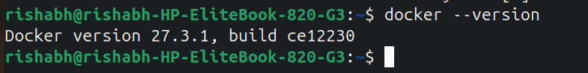
   
- **We have to check docker status-**

   ```bash
  systemctl status docker
  ```
  - systemctl: Command-line tool for managing systemd services, which handle system and service startup.

    **We see status : active then docker is running properly**
  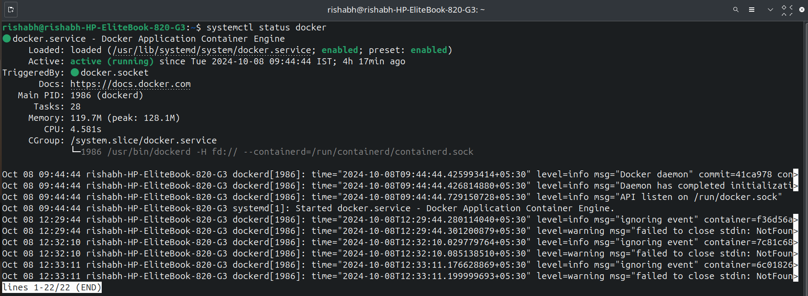

  **- If we see status : inacitve like this-**
    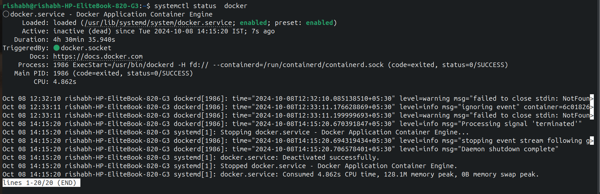

   **Then run this command for running docker -**

  ```bash
   systemctl start docker 
   ```
   **And after this docker will be in active mode .**
   
  
### Now we have installed docker properly and learned how to start and stop docker as per our work:
---
## Step 3: Build Youki

### Task:
- Now, we will build Youki from its source code.

### Steps to Build Youki:

1. **Install Required Dependencies:**
   - Type this command:
     ```bash
     sudo apt-get install libseccomp-dev pkg-config build-essential
     ```

- sudo: Runs the command with superuser (administrator) privileges.
- apt-get: A command-line tool for handling packages in Debian-based systems.
- install: Installs the specified packages.
- libseccomp-dev: Development files for the libseccomp library, used for filtering system calls.
- pkg-config: Tool to manage compile and link flags for libraries.
- build-essential: A package that includes essential tools for building software (like compilers).

2. **Clone the Youki Repository:**
   - This means we will get the Youki code from the internet. Type:
     ```bash
     git clone https://github.com/containers/youki.git
     ```

3. **Change Directory to Youki Folder:**
   - Move to the Youki folder:
     ```bash
     cd youki
     ```

4. **Build Youki:**
   - Type this command to compile the code:
     ```bash
     cargo build --release
     ```

     - cargo: The Rust package manager and build system.
     - build: The command to compile the project.
     - --release: Flag to optimize the build for release (faster and smaller executable).
   
    **After this, you should see an executable file created.**
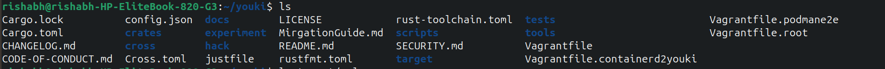
---

## Step 4: Setting up Youki as a default runtime
### Task:
- Configure Docker to use Youki by default.

### Steps to Set Youki as Default:

1. **Edit Docker's Configuration File:**
   - Open the file for editing:
     ```bash
     sudo vim /etc/docker/daemon.json
     ```
   - sudo: Runs the command with superuser (administrator) privileges.
   - vim: A text editor used to edit files in the terminal.
   - /etc/docker/daemon.json: The path to the Docker daemon configuration file, where you can set various options for the Docker service.
   **If your system do not have VIM text editor , we can either install using

     ```bash
     sudo apt install vim
     ```
     **Or we can use**

     ```bash
     sudo nano /etc/docker/daemon.json
     ```
     **Nano is also a text editor which can be used to edit text's.** 

2. **Add Youki as the Default Runtime:**
   - Add this code inside the file:
  ```json
      {
        "default-runtime": "youki",
           "runtimes": {
               "youki": {
         "path": "/usr/local/bin/youki"
        }
      }
}
 ```
   - Replace `/path/to/youki` with the actual path where Youki was built.

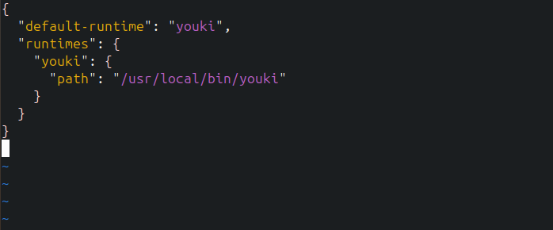 

**for checking where youki was build type command**
```bash
   which youki
```
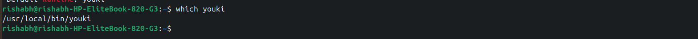 

3. **Restart Docker:**
   - Type this command:
     ```bash
     sudo systemctl restart docker
     ```
**Restarting Docker allows it to recognize and integrate the new container runtime (Youki) properly.**
---

## Step 5: Run a container using Youki Runtime

### Task:
- Run a container using Youki.

### Steps to Pull and Run a Container:

1. **Pull an Image from Docker Hub:**
   - This downloads a small version of a program. Type:

      ```bash
         docker pull alpine
      ```
     **After running this command an Image will be pulled.**

2. **Run a Container Using Youki**
   - Start a container using the command:

      ```bash
     docker run --rm -it alpine
     ```
      
     - docker: Command-line tool for managing Docker containers.
     - run: Tells Docker to create and start a new container.
     - --rm: Automatically removes the container when it exits.
     - -it: Combines two options:
     - -i: Keeps the standard input open.
     - -t: Allocates a pseudo-TTY (terminal).
     - alpine: The name of the Docker image to use, which is a lightweight Linux distribution.

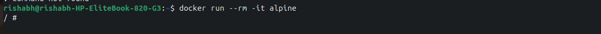

**We can see in above image that container is running for verifying it we can use following command**
 
  ```bash
     docker ps
  ```
   - docker: This is the command-line interface for interacting with Docker.
   - ps: This stands for "process status." In the context of Docker, it lists the containers that are currently active (running).
    
    
  
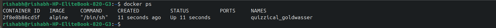

---

## Step 6: Ensuring that the images which is pulled is using runtime Youki.

```bash
docker inspect CONTAINER_ID | grep -i "runtime"

```
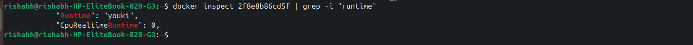

**For checking container id we can use**
```bash
docker ps
```


## Step 7: Checking default runtime .

```bash
docker info | grep -i runtime
```
- docker info: Shows details about Docker.
- |: Sends the output to the next command.
- grep -i runtime: Looks for lines that mention "runtime" (case insensitive).

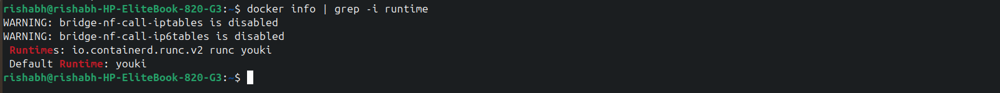

---
## 

## Conclusion
In this journal, I successfully installed Youki and configured it as the default runtime for Docker. This process involved several key steps, including installing Rust and Docker, building Youki from source, and setting up Docker to recognize Youki as its primary runtime.

- **Key Takeaways:**
1. Understanding Containerization: I learned that container runtimes like Youki make it easier to run and manage applications by keeping everything they need in one package.
2. Practical Skills: Installing Youki and Docker helped me get better at using the command line and understanding how Docker works.

